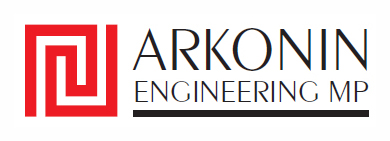

<div align="center">



# Company Profile — PT. Arkonin Engineering Manggala Pratama

**A modern, bilingual corporate website built with Laravel**


</div>

---

## 📋 About This Project

This is a **full-stack corporate profile website** developed for PT. Arkonin Engineering Manggala Pratama — an Indonesian engineering consultancy firm. The website serves as the company's digital presence, showcasing their expertise, projects, insights, and career opportunities.

Built during my role as **Database & Web Development Officer** at PT. Arkonin (Oct 2025 – Feb 2026).

---

## ✨ Features

- 🌐 **Bilingual Support** — Full Indonesian & English language toggle
- 🎠 **Hero Slider** — Dynamic image carousel on the homepage
- 📰 **Insights / News** — Admin-managed articles and publications
- 💼 **Careers** — Job listing with application form
- 📁 **Projects Portfolio** — Showcase of engineering projects
- 📬 **Contact Form** — Message submission with admin notification
- 🔐 **Admin Panel** — Secure dashboard to manage all content
- 📱 **Responsive Design** — Optimized for desktop and mobile
- ☁️ **Cloud-ready** — Integrated with cloud database infrastructure

---

## 🛠️ Tech Stack

| Layer | Technology |
|:---|:---|
| Backend Framework | Laravel 11 |
| Language | PHP 8.x |
| Database | MySQL |
| Frontend | Blade Templates, HTML5, CSS3, JavaScript |
| Package Manager | Composer, NPM |
| Local Server | Laragon |

---

## ⚙️ Installation & Setup

### Prerequisites
- PHP >= 8.1
- Composer
- MySQL
- Node.js & NPM
- Laragon (recommended) or XAMPP

### Steps

**1. Clone the repository**
```bash
git clone https://github.com/ShakiraAngelina/company-profile.git
cd company-profile
```

**2. Install PHP dependencies**
```bash
composer install
```

**3. Install JS dependencies**
```bash
npm install
```

**4. Setup environment file**
```bash
cp .env.example .env
php artisan key:generate
```

**5. Configure database**

Edit `.env` file and update:
```env
DB_DATABASE=company_profile
DB_USERNAME=root
DB_PASSWORD=
```

**6. Run migrations**
```bash
php artisan migrate
```

**7. Run the application**
```bash
php artisan serve
```

Open your browser at `http://localhost:8000` or `http://company-profile.test` (Laragon)

---

## 📁 Project Structure

```
company-profile/
├── app/
│   ├── Http/Controllers/    # AdminAuth, Careers, Contact, Insights, etc.
│   ├── Models/              # Application, Career, News, Project, Publication, etc.
│   └── Observers/           # Model activity tracking
├── database/
│   ├── migrations/          # Database schema
│   └── schema.sql           # Full SQL dump
├── public/
│   ├── assets/
│   │   ├── CSS/             # Page-specific stylesheets
│   │   ├── JS/              # Page-specific scripts
│   │   ├── images/          # Company images & assets
│   │   └── i18n/            # Language files (en.json, id.json)
├── resources/
│   └── views/               # Blade templates (about, careers, contact, admin, etc.)
└── routes/
    └── web.php              # Application routes
```

---

## 🔐 Admin Panel

The website includes a secure admin dashboard accessible at:
```
http://localhost:8000/admin
```

Admin can manage:
- 📰 News & Publications
- 💼 Career Listings
- 📁 Projects
- 💬 Contact Messages & Applications
- 🔔 Notifications

---

## 👩‍💻 Developer

<div align="center">

**Shakira Angelina Ika Putri**
*Database & Web Development Officer*

[](https://linkedin.com/in/shakiraangelinaikaputri)
[](https://github.com/ShakiraAngelina)
[](https://bit.ly/Portofolio_Shakira)

</div>

---

<div align="center">

*Built with ❤️ for PT. Arkonin Engineering Manggala Pratama*

</div>
